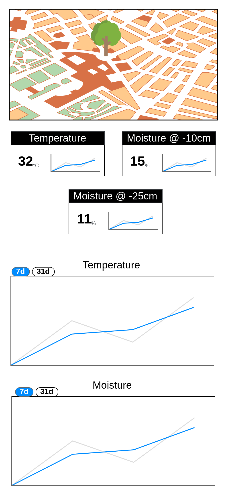

# Mobile Apps - Assignment - API - Captcha - Progress - Vuetify

Use this repository to combine the different assignments you made for the course mobile apps.

This includes the following:

* TODO Listing
* Funny Captcha component
* Progress Bar
* GitHub API
* Chuck Norris Question

Make sure to create a view for each of these components and style everything with vuetify. This means you will need to refactor all your components to make use of the vuetify components.

Setup a general application wireframe with at least a `v-main`, a `v-app-bar` and a `v-footer`.

Allow the user to navigate between the different views by means of the `v-app-bar`.

Add some general information about yourself in the `v-footer` component.

## DUST API

DUST is een project waarbij bodemvocht in kaart wordt gebracht. Bomen en hun omgeving worden voorzien van verschillende sensoren (temperatuur, bodemvocht, regenval, wind, ...).

Al deze informatie wordt publiek ter beschikking gesteld via de API [https://dust.devbitapp.be/api](https://dust.devbitapp.be/api) met bijhorende documentatie op [https://dust.devbitapp.be/docs/api](https://dust.devbitapp.be/docs/api).

De bedoeling is nu dat je een overzicht creëert van de bomen die in DUST zijn geregistreerd. In 1ste instantie mag dit gewoon een lijst zijn van de bomen. Later dien je hier een kaart te tonen met de locatie en een pin op de map per boom.

Wanneer een user op een boom klikt dient te worden overgegaan naar een detail-pagina die de laatste waarde van de verschillende sensoren weergeeft van de boom met een kort trendlijn erbij.

* De verschillende sensoren in een boom kan je raadplegen via de API route [https://dust.devbitapp.be/api/trees/:tree_id](https://dust.devbitapp.be/api/trees/:tree_id). Hier krijg je een lijst van sensors en hun laatste waarde.
* De trendline kan je bekomen door een API call te maken naar de route van de sensor, namelijk [https://dust.devbitapp.be/api/sensors/:sensor_id?period=24h](https://dust.devbitapp.be/api/sensors/:sensor_id?period=24h). Merk hierbij de query string `period=24h` op.
* Voor de trendline mag je zelf een chart-library (bv. chartjs, apexcharts, ...) kiezen die je wil gebruiken.
* Maak een component waarin je de details (huidige waarde, trendline, unit, naam) van een sensor toont. Je kan hierbij ook nog bv. een icon weergeven.

Toon ook bovenaan de pagina de kaart met de locatie van de boom gecentreerd.

Als laatste dien je ook nog van 2 sensoren de historiek weer te geven aan de hand van een gedetailleerde chart. Je mag zelf kiezen welke. Zorg er wel voor dat je dit in een component verwerkt zodat we er later eventueel makkelijk kunnen toevoegen. Hiervoor kan je de API route van e sensor opnieuw gebruiken maar ditmaal met een langere periode. Bv: `period=31d`.

Een mockup die inspiratie kan brengen vind je hier:

## Netlify

Build het project via GitHub actions en deploy het op Netlify.

## Docker

Voorzie een Dockerfile om het project lokaal/op server te runnen.

## README

Zorg dat je project een deftige README (English) heeft. Minimaal moet volgende aanwezig zijn:

* beschrijving van het project
* opzet (commands + uitleg)
* screenshots
* dingen die niet werken
* dingen die beter kunnen
